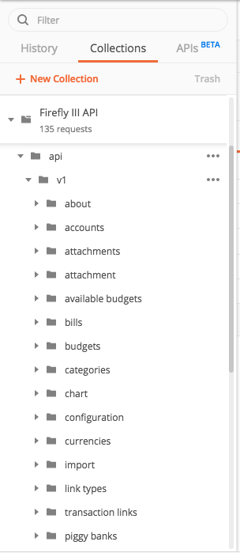

# Firefly III API documentation

The Firefly III API documentation can be found on [api-docs.firefly-iii.org](https://api-docs.firefly-iii.org). This repository holds the static website (in the `/dist` directory) and the source files (in the `/src` directory).

The source files are split up in paths that correspond to the API endpoints (under `/src/v1`). General templates and other items are in the `templates` and `shared` directory. The API specification is generated by stitching together these files using a build script, the [API docs generator](https://github.com/firefly-iii/api-docs-generator).

The results are uploaded to this repository and can be viewed live at [api-docs.firefly-iii.org](https://api-docs.firefly-iii.org/).

## Contributing

Feel free to create a PR on anything. If you want to change endpoints, check out `src/v1/paths`. Or edit objects in `/src/v1/schemas`. This is my first API document so feel free to tell me how to improve. Make your changes and submit a pull request.

## Branches

This repository is branched for each Firefly III version. The `main` branch holds the latest develop version.

## Templates

You can see lines in the YAML files that look like this:

```yaml
_tpl_correlationParameter,3:
```

These are placeholders which will change during build. You see the name of the template (see `/src/templates/`), and the number tabs to indent the template.

## Using the API specification

If you want, you can download the yaml file you need from the `dist` directory and import it into your favorite API development environment to play around with, e.g. [Postman](https://www.getpostman.com/).



## Develop with Firefly III

Are you interested in (future) API changes to Firefly III, or other interesting dev-related updates? Sign up to the [Firefly III developer newsletter](https://firefly-iii.kit.com/dev) to receive low-frequency updates about the development of Firefly III.

<!-- HELP TEXT -->

## Do you need help, or do you want to get in touch?

Do you want to contact me? You can email me at [james@firefly-iii.org](mailto:james@firefly-iii.org) or get in touch through one of the following support channels:

- [GitHub Discussions](https://github.com/firefly-iii/firefly-iii/discussions/) for questions and support
- [Gitter.im](https://gitter.im/firefly-iii/firefly-iii) for a good chat and a quick answer
- [GitHub Issues](https://github.com/firefly-iii/firefly-iii/issues) for bugs and issues
- <a rel="me" href="https://fosstodon.org/@ff3">Mastodon</a> for news and updates

<!-- END OF HELP TEXT -->

<!-- SPONSOR TEXT -->

## Support the development of Firefly III

If you like Firefly III and if it helps you save lots of money, why not send me a dime for every dollar saved! 🥳

OK that was a joke. If you feel Firefly III made your life better, please consider contributing as a sponsor. Please check out my [Patreon](https://www.patreon.com/jc5) and [GitHub Sponsors](https://github.com/sponsors/JC5) page for more information. You can also [buy me a ☕️ coffee at ko-fi.com](https://ko-fi.com/Q5Q5R4SH1). Thank you for your consideration.

<!-- END OF SPONSOR TEXT -->

